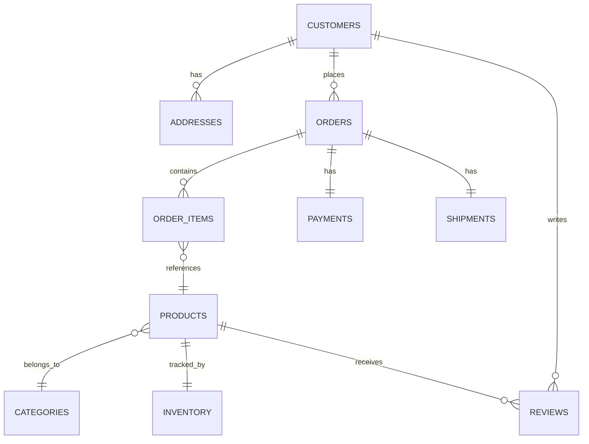

# Database Schema Overview

This document describes the schema for the sample e-commerce-style database used throughout this portfolio. The database was AI-generated to serve as a realistic, purpose-built target for SQL practice and QA validation work, rather than relying on a pre-built public dataset.

---

## Tables

| Table       | Description                          |
| ----------- | ------------------------------------- |
| customers   | Customer accounts                      |
| addresses   | Customer shipping/billing addresses    |
| categories  | Product categories                     |
| products    | Products for sale                      |
| inventory   | Inventory by product                   |
| orders      | Customer orders                        |
| order_items | Products within an order                |
| payments    | Payment transactions                    |
| shipments   | Shipment tracking                       |
| reviews     | Product reviews                         |

---

## Entity Relationship Diagram

---

## Business Rules

### Customers
* Email must be unique.
* Customer cannot be deleted (soft delete only).
* Customer may have multiple addresses.

### Products
* SKU must be unique.
* Price must be greater than zero.
* Product belongs to exactly one category.

### Orders
* Must contain at least one order item.
* Total amount equals `sum(order_items)`.
* Status values: `Pending`, `Paid`, `Shipped`, `Cancelled`.

### Inventory
* Quantity >= 0
* Reorder level >= 0

### Payments
* Amount = Order Total
* Status values: `Pending`, `Completed`, `Failed`, `Refunded`.

### Shipments
* Ship date >= Order date
* Delivered date >= Ship date

---

## Why This Matters for QA

These business rules are the basis for the validation queries and test cases in this repo — each rule above maps to at least one SQL check (e.g. uniqueness constraints, referential integrity, status enum validation, date-order logic) under `validation/` and `test-cases/`.
