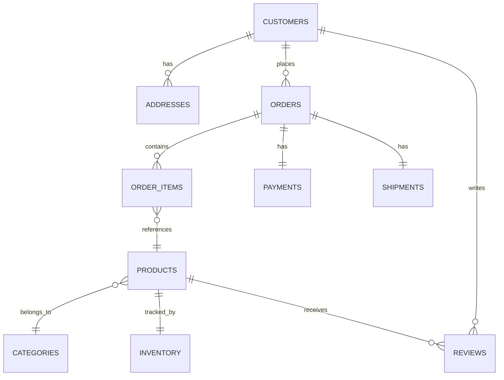

# Database Schema Overview

This document describes the schema for the sample e-commerce-style database used throughout this portfolio. The database was AI-generated to serve as a realistic, purpose-built target for SQL practice and QA validation work, rather than relying on a pre-built public dataset.

---

## Tables

| Table       | Description                          |
| ----------- | ------------------------------------- |
| customers   | Customer accounts                      |
| addresses   | Customer shipping/billing addresses    |
| categories  | Product categories                     |
| products    | Products for sale                      |
| inventory   | Inventory by product                   |
| orders      | Customer orders                        |
| order_items | Products within an order                |
| payments    | Payment transactions                    |
| shipments   | Shipment tracking                       |
| reviews     | Product reviews                         |

---
### Data Dictionary

Column-level reference for the ShopSmart database.

#### categories

| Column | Type | Nullable | Default | Notes |
|---|---|---|---|---|
| `category_id` | INT | No | auto-increment | Primary key |
| `category_name` | VARCHAR(100) | No | — | Unique (`uq_category_name`) |
| `description` | VARCHAR(255) | Yes | NULL | Optional |
| `is_active` | BOOLEAN | No | TRUE | |
| `created_at` | DATETIME | No | CURRENT_TIMESTAMP | |
| `updated_at` | DATETIME | No | CURRENT_TIMESTAMP | Auto-updates on row update |

---

#### customers

| Column | Type | Nullable | Default | Notes |
|---|---|---|---|---|
| `customer_id` | INT | No | auto-increment | Primary key |
| `first_name` | VARCHAR(50) | No | — | |
| `last_name` | VARCHAR(50) | No | — | |
| `email` | VARCHAR(255) | No | — | Unique (`uq_customer_email`); indexed (`idx_customer_email`) |
| `phone` | VARCHAR(20) | Yes | NULL | Optional |
| `date_of_birth` | DATE | Yes | NULL | Optional |
| `account_status` | ENUM('ACTIVE','INACTIVE','SUSPENDED') | No | 'ACTIVE' | Indexed (`idx_customer_status`) |
| `created_at` | DATETIME | No | CURRENT_TIMESTAMP | |
| `updated_at` | DATETIME | No | CURRENT_TIMESTAMP | Auto-updates on row update |
| `is_deleted` | BOOLEAN | No | FALSE | Soft-delete flag |

---

#### addresses

| Column | Type | Nullable | Default | Notes |
|---|---|---|---|---|
| `address_id` | INT | No | auto-increment | Primary key |
| `customer_id` | INT | No | — | FK → `customers.customer_id`; `ON DELETE RESTRICT`, `ON UPDATE CASCADE`; indexed (`idx_address_customer`) |
| `address_type` | ENUM('SHIPPING','BILLING') | No | — | |
| `address_line_1` | VARCHAR(150) | No | — | |
| `address_line_2` | VARCHAR(150) | Yes | NULL | Optional |
| `city` | VARCHAR(80) | No | — | |
| `state` | VARCHAR(80) | No | — | |
| `postal_code` | VARCHAR(20) | No | — | |
| `country` | VARCHAR(80) | No | — | |
| `is_default` | BOOLEAN | No | FALSE | One default per `address_type` intended, per business rules — **no DB-level constraint enforces this** |
| `created_at` | DATETIME | No | CURRENT_TIMESTAMP | |
| `updated_at` | DATETIME | No | CURRENT_TIMESTAMP | Auto-updates on row update |

---

#### products

| Column | Type | Nullable | Default | Notes |
|---|---|---|---|---|
| `product_id` | INT | No | auto-increment | Primary key |
| `category_id` | INT | No | — | FK → `categories.category_id`; `ON DELETE RESTRICT`, `ON UPDATE CASCADE`; indexed (`idx_product_category`) |
| `product_name` | VARCHAR(150) | No | — | |
| `description` | VARCHAR(500) | Yes | NULL | Optional |
| `sku` | VARCHAR(50) | No | — | Unique (`uq_product_sku`) |
| `price` | DECIMAL(10,2) | No | — | No CHECK constraint enforcing > 0 (see gap below) |
| `stock_quantity` | INT | No | 0 | Lives on `products`, not a separate `inventory` table (see gap below) |
| `is_active` | BOOLEAN | No | TRUE | |
| `created_at` | DATETIME | No | CURRENT_TIMESTAMP | |
| `updated_at` | DATETIME | No | CURRENT_TIMESTAMP | Auto-updates on row update |

---

#### orders

| Column | Type | Nullable | Default | Notes |
|---|---|---|---|---|
| `order_id` | INT | No | auto-increment | Primary key |
| `customer_id` | INT | No | — | FK → `customers.customer_id`; `ON DELETE RESTRICT`, `ON UPDATE CASCADE`; indexed (`idx_order_customer`) |
| `shipping_address_id` | INT | No | — | FK → `addresses.address_id`; `ON DELETE RESTRICT`, `ON UPDATE CASCADE` |
| `billing_address_id` | INT | No | — | FK → `addresses.address_id`; `ON DELETE RESTRICT`, `ON UPDATE CASCADE` |
| `order_date` | DATETIME | No | — | |
| `order_status` | ENUM('PENDING','PROCESSING','SHIPPED','DELIVERED','CANCELLED') | No | 'PENDING' | Indexed (`idx_order_status`); **differs from business-rules.md's `Pending/Paid/Shipped/Cancelled`** (see gap below) |
| `total_amount` | DECIMAL(10,2) | No | — | |
| `created_at` | DATETIME | No | CURRENT_TIMESTAMP | |
| `updated_at` | DATETIME | No | CURRENT_TIMESTAMP | Auto-updates on row update |

---

#### order_items

| Column | Type | Nullable | Default | Notes |
|---|---|---|---|---|
| `order_item_id` | INT | No | auto-increment | Primary key |
| `order_id` | INT | No | — | FK → `orders.order_id`; `ON DELETE CASCADE`, `ON UPDATE CASCADE`; indexed (`idx_orderitem_order`) |
| `product_id` | INT | No | — | FK → `products.product_id`; `ON DELETE RESTRICT`, `ON UPDATE CASCADE` |
| `quantity` | INT | No | — | No CHECK constraint enforcing > 0 (see gap below) |
| `unit_price` | DECIMAL(10,2) | No | — | Snapshot of price at purchase, as intended by business rules |
| `line_total` | DECIMAL(10,2) | No | — | Not a generated column — must be validated against `quantity * unit_price` |

---

#### payments

| Column | Type | Nullable | Default | Notes |
|---|---|---|---|---|
| `payment_id` | INT | No | auto-increment | Primary key |
| `order_id` | INT | No | — | FK → `orders.order_id`; `ON DELETE CASCADE`, `ON UPDATE CASCADE` |
| `payment_date` | DATETIME | No | — | |
| `amount` | DECIMAL(10,2) | No | — | |
| `payment_method` | ENUM('CREDIT_CARD','DEBIT_CARD','PAYPAL','BANK_TRANSFER','GIFT_CARD') | No | — | |
| `payment_status` | ENUM('PENDING','COMPLETED','FAILED','REFUNDED') | No | 'COMPLETED' | Matches business-rules.md values (case aside) |

---

#### shipments

| Column | Type | Nullable | Default | Notes |
|---|---|---|---|---|
| `shipment_id` | INT | No | auto-increment | Primary key |
| `order_id` | INT | No | — | FK → `orders.order_id`; `ON DELETE CASCADE`, `ON UPDATE CASCADE` |
| `carrier` | ENUM('UPS','FEDEX','USPS','DHL') | No | — | |
| `tracking_number` | VARCHAR(50) | No | — | |
| `shipment_status` | ENUM('PREPARING','IN_TRANSIT','DELIVERED','RETURNED') | No | 'PREPARING' | |
| `shipped_date` | DATETIME | **Yes** | NULL | Nullable until shipment occurs |
| `delivered_date` | DATETIME | **Yes** | NULL | Nullable until delivery occurs; business rule "delivered_date >= ship_date" only applies once both are populated |

---

#### reviews

| Column | Type | Nullable | Default | Notes |
|---|---|---|---|---|
| `review_id` | INT | No | auto-increment | Primary key |
| `product_id` | INT | No | — | FK → `products.product_id`; `ON DELETE CASCADE`, `ON UPDATE CASCADE` |
| `customer_id` | INT | No | — | FK → `customers.customer_id`; `ON DELETE CASCADE`, `ON UPDATE CASCADE` |
| `rating` | TINYINT | No | — | CHECK constraint `rating BETWEEN 1 AND 5` — enforced at DB level |
| `review_text` | VARCHAR(1000) | Yes | NULL | Optional |
| `created_at` | DATETIME | No | CURRENT_TIMESTAMP | |

---

## Entity Relationship Diagram

---

## Business Rules
See "business-rules.md" for the full rule set.

---

## Why This Matters for QA

These business rules are the basis for the validation queries and test cases in this repo — each rule above maps to at least one SQL check (e.g. uniqueness constraints, referential integrity, status enum validation, date-order logic) under `validation/` and `test-cases/`.
